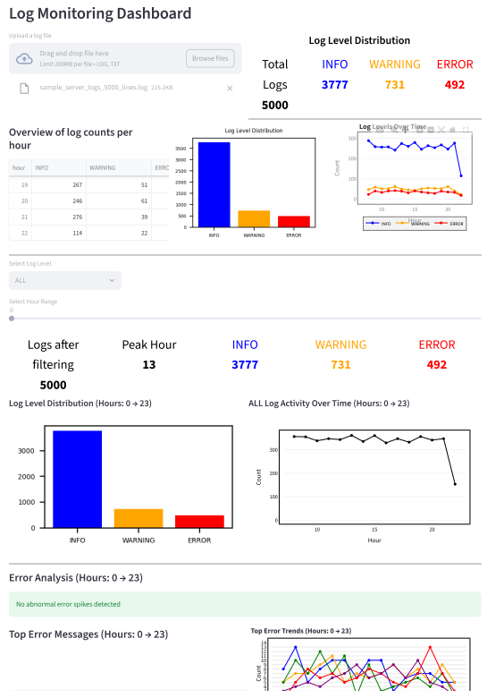

# Log Analyzer Dashboard

An interactive log monitoring dashboard built with Python, Pandas, and Streamlit.

---

## Features

* Upload log files
* Filter by log level
* Filter by time range
* Visualize logs (charts)
* Detect error spikes
* View top error messages
* Export filtered data as CSV

---

## Screenshots



---

## Tech Stack

* Python
* Pandas
* Streamlit
* Matplotlib

---

## How to Run

```bash
pip install -r requirements.txt
streamlit run src/log_analyzer/dashboard.py
```

---

## Project Structure

```
log-analyzer/
│
├── src/
│   └── log_analyzer/
│       ├── parser.py
│       ├── analysis.py
│       └── dashboard.py
│
├── logs/
├── requirements.txt
└── README.md
```

---

## Author

Abdelmenem Elgabry
